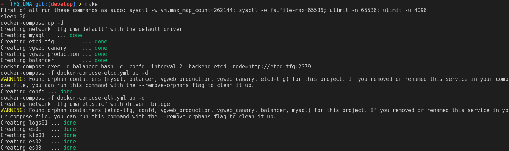
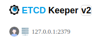

# TFG_UMA

## 1. INTRODUCCIÓN

Este proyecto permite la creación de varios procesos necesarios para la creación de una web simple pero precisa y rápida, permitiendo desde lectura de logs en kibana hasta el balanceo entre diferentes procesos,aunque principalmente está pensada para desarrollo local puede extrapolarse a producción de manera fácil y rápida.

Los principales componentes son:

1. Aplicación en docker
2. Bases de datos en docker
3. Balanceador en docker
4. Etcd-confd
5. ELK Stack

Todos estos componentes funcionan de forma conjunta con un simple despliegue gracias a un archivo llamado ```Makefile```.

## 2. Despliegue

El despligue de la aplicación es como se ha comentado sencillo, puede ocurrir algún error en el despliegue, que se comentará más abajo de este texto.

Para levantar el proyecto se necesita lanzar un comando en la carpeta raíz del proyecto llamado `make` que realizará lo siguiente:



Como vemos levantará toda la aplicación, teneindo en cuenta que se ha de lanzar los comandos que dice para su correcto funcionamiento, ya que permiten levantarse al ELK Stack.

Si se quieren realizar comandos en tiempo real se debe lanzar el comando `make up-etcdkeeper`.

## 3. Funcionamiento básico

Para el funcionamiento básico hay que tener en cuenta los puertos asignados a la aplicación en cada moento, los puertos por defecto son:

| Servicio  | Puerto  |
|---|---|
| Aplicación  |  Sin definir (envío por balanceador) |
| Balanceador | 8080  |
| Kibana  | 5601  |
| etcdkeeper | 8800 |
| Base de datos | 3306 |

Todo es accesible desde localhost:{Puerto} sin ningún tipo de contraseñapara facilitar el desarrollo, pero ha de tener en cuenta de que se podrían añadir si fuera necesario (la base de datos es la unica excepción ya que necesita usuario-contraseña).

## 4. Errores

Pueden ocurrir varios errores en la aplicacion que comentaré uno a uno:

- El error más comun es **no ver la web tras el levantamiento de los contenedores** (si sale un 502 es correcto) y se puede deber a varios motivos, pero el general es que no se ha creado la configuración necesaria en el balanceador puesto que cada etcd es necesario crearlo desde 0, por lo que has de añadir los directorios necesarios como `/service/vgweb/balancer/canary/percentage` que aparecen en los tmpl de confd en la carpeta etc, aunque también puede ocurrir cuando no se han instalado los requisitos necesarios como docker-compose y docker.
- Otro error viene dado por la **base de datos** ya que no hemos logrado levantar la base de datos con una estructura completa, la estructura es simple, pero si no aparece ninguna tabla, habría que crearla a mano, siendo el nombre por defecto `vgapp`.
- El siguiente error que podemos observar es el fallo a la hora de levantar los contenedores de **ELK Stack** puesto que estos contenedores necesitan lanzar antes el comando como sudo `sysctl -w vm.max_map_count=262144; sysctl -w fs.file-max=65536; ulimit -n 65536; ulimit -u 4096;`
- Por último puede ocurrir un error con **etcdkeeper** ya que esta aplicación está modificada para poder lanzarse con un dokcer-compose pero al no estar pensado para ello suele dar varios problemas, hay que tener la configuración de la siguiente forma, teniendo en cuenta de que estamos con la aplicación en local y con los comandos por defectos, si la aplicación estuviera en diferentes servidores sería otra configuración que hiciera un tunel a donde se encuentren los etcd. Se puede cambiar haciendo click en v2 si te aparece v3



## Soporte

Para cualquier tipo de problema con la infraestructura se puede enviar un correo a rafaelhormigog@gmail.com y se intenará mantener actualizaciones con lo recibido por los usuarios.
